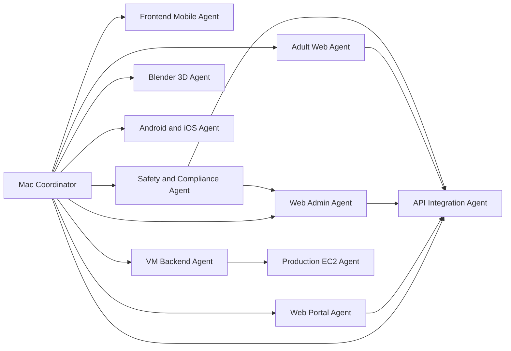

# Leggau Agent Architecture

The Leggau project uses a local, repository-backed agent model. The MacBook acts as the coordinator, `vm2` acts as the backend execution host, and EC2 remains the future production target.

## Topology

## Agent Responsibilities

- `Mac Coordinator`: assign work, preserve memory, keep git and docs synchronized.
- `Frontend Mobile`: own Unity scenes, UI, bootstrap flow and runtime session state.
- `Adult Web`: own parent and therapist responsive web/PWA surfaces.
- `Safety and Compliance`: own rulebook, moderation architecture, consent policy and security gates.
- `Blender 3D`: own Gau source art, variants, rigging and FBX exports.
- `Android and iOS`: keep target settings, SDKs and build readiness aligned.
- `API Integration`: keep frontend and backend contracts stable and versioned.
- `Web Portal`: own institutional site, distribution surface and public legal pages.
- `Web Admin`: own operations console, user administration and billing sandbox visibility.
- `VM Backend`: operate the remote backend stack on `vm2`.
- `Production EC2`: prepare the later hardened cloud deployment.

## Canonical Storage

- Project root: `/Volumes/SSDExterno/Desenvolvimento/Leggau`
- Local memory: `/Volumes/SSDExterno/Desenvolvimento/Leggau/.codex`
- Heavy runtime data: `/Volumes/SSDExterno/Desenvolvimento/Leggau/.data`
- Remote backend root: `~/leggau`

## Branch Model

- `main`: integration and memory-backed project truth
- `backend`: backend-only environment line
- `frontend-android`: Android-oriented frontend line
- `frontend-ios`: iOS-oriented frontend line

## Secret Policy

- Do not store passwords, private keys, tokens or production credentials in repo memory.
- Keep only hosts, aliases, placeholders, paths, ports and conventions.

## Delivery Rules

- Every completed delivery must refresh `.codex` memory and commit the result.
- The Mac coordinator owns synchronization across all agents.
- The VM agent owns backend execution and reporting.
- The production agent stays dormant until the VM is stable.
